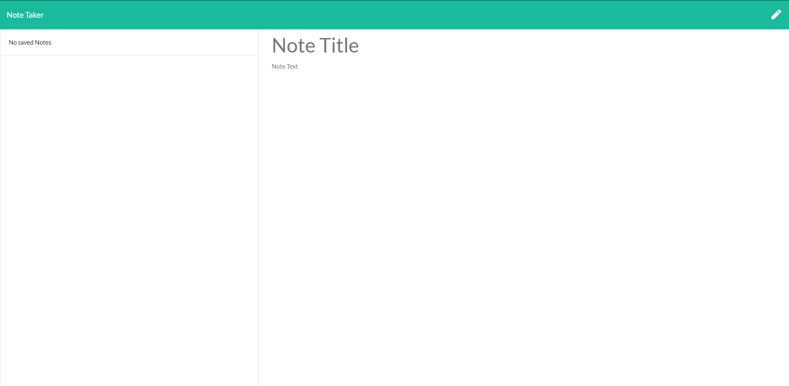

# Note-Taker


## Application-Picture


## Technologies Used
    - Javascript - Used to write the functions of the application
    - Git - Version control system to track changes to source code
    - GitHub - Hosts repository that can be deployed to GitHub pages


## Summary 
    Built an application to gather user input ("Notes") and save them. 

## Code Snippet
    Down below is a snippet from my back end script where we can read and write the user input into JSON and then return it back to the web page.
``` app.get("/api/notes", function (req, res) {
    fs.readFile('./db/db.json', 'utf8', (err, data) => {
        if (err) throw err;
        const newData = JSON.parse(data);
        res.json(newData);
    })
})

app.post("/api/notes", function (req, res){
    fs.readFile('./db/db.json', 'utf8', (err, data) => {
        if (err) throw err;
        const newData = JSON.parse(data);
        const newNote = req.body;
        newNote.id = newData.length + 1;
        newData.push(newNote);
    
    fs.writeFile('./db/db.json', JSON.stringify(newData) ,(err) => {
        if (err) throw err;
        res.json(newData);
    });
    
    
});
});
```

## Author Links
[LinkedIn](https://www.linkedin.com/in/liamsctewart/)<br>
[Github](https://github.com/LiamStewart8)<br>
[Application Link](https://fierce-caverns-62000.herokuapp.com/)<br>
